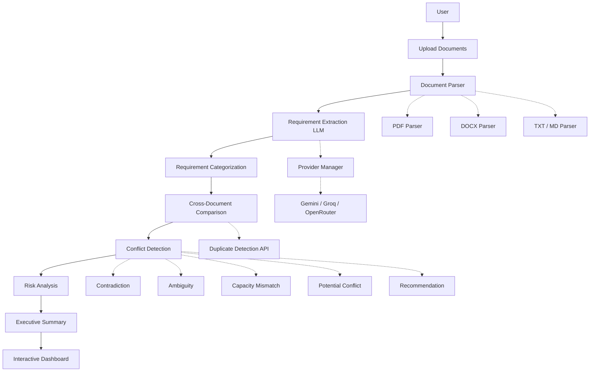
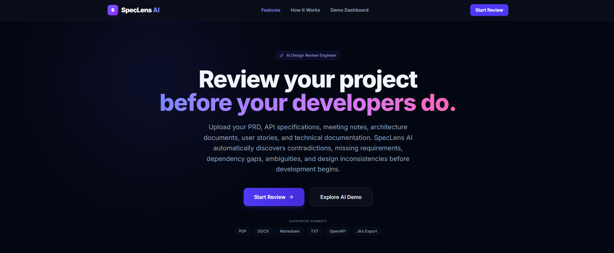
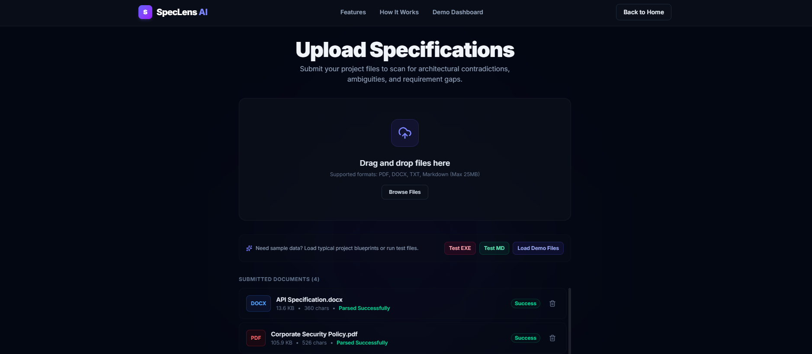
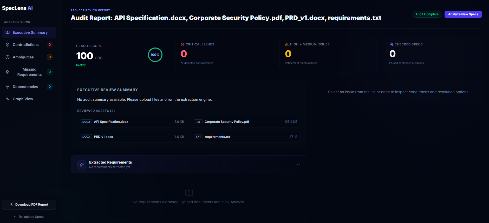
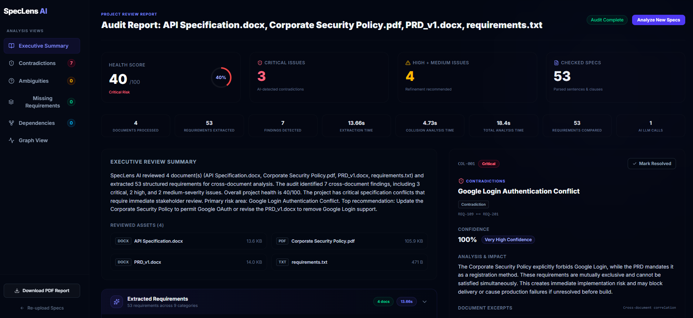
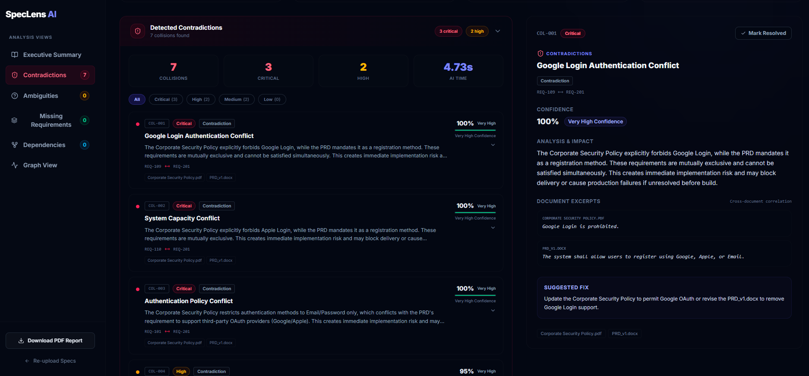
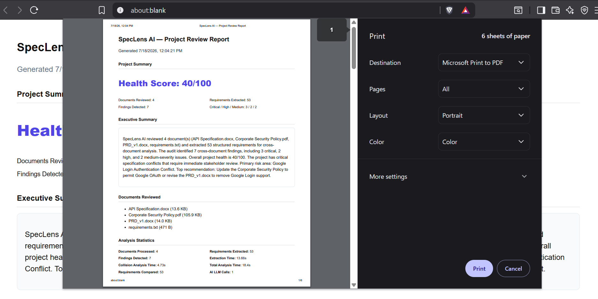

<div align="center">

# SpecLens AI

### Review your project before your developers do.

[](https://spec-lens-ai-eta.vercel.app/)
[](https://github.com/Rushik-Banakar/SpecLens-AI)
[](https://drive.google.com/file/d/1a3Ewui1Gy6IlBwjWZlvgm0gdgWi_ZJ0V/view?usp=sharing)
[](https://drive.google.com/file/d/1eBD0kKEBcunLOZ2QZUjga0zslpPeYwCD/view?usp=sharing)

[](https://fastapi.tiangolo.com/)
[](https://react.dev/)
[](https://vitejs.dev/)
[](https://www.python.org/)
[](LICENSE)

**SpecLens AI** is an AI-powered Design Review Engineer that helps engineering teams identify specification issues before development begins. It transforms scattered project knowledge into actionable insights by detecting contradictions, ambiguities, missing requirements, and engineering risks before a single line of code is written.

</div>

---

## 🔗 Quick Links

| Resource | Link |
| --- | --- |
| **Live Application** | [spec-lens-ai-eta.vercel.app](https://spec-lens-ai-eta.vercel.app/) |
| **GitHub Repository** | [Rushik-Banakar/SpecLens-AI](https://github.com/Rushik-Banakar/SpecLens-AI) |
| **3-Minute Demo Video** | [Watch on Google Drive](https://drive.google.com/file/d/1a3Ewui1Gy6IlBwjWZlvgm0gdgWi_ZJ0V/view?usp=sharing) |
| **1-Minute Project Overview** | [Watch on Google Drive](https://drive.google.com/file/d/17b36y0B0jufnIjjA1rljtPQCpMbcQl83/view?usp=sharing) |
| **Pitch Deck** | [View on Google Drive](https://drive.google.com/file/d/1eBD0kKEBcunLOZ2QZUjga0zslpPeYwCD/view?usp=sharing) |

---

## Problem Statement

Software projects rarely fail because teams cannot write code. They fail because **requirement documents are inconsistent**.

PRDs, API specifications, security policies, and architecture notes often evolve independently across teams and tools. When engineering starts, organizations pay the price:

- **Inconsistent specifications** create conflicting implementation decisions across documents
- **Wasted engineering effort** reconciling documentation instead of building features
- **Bugs that originate from unclear or contradictory requirements**—not from poor coding

SpecLens AI addresses this upstream. By analyzing specification documents **before development starts**, it gives stakeholders a structured audit: extracted requirements, cross-document findings, severity scoring, and actionable recommendations—so teams align on a single source of truth before production code is written.

---

## Solution

SpecLens AI turns unstructured project documentation into a reviewable specification audit through a clear, automated pipeline:

1. **Upload** — Submit multiple specification files (PDF, DOCX, TXT, Markdown) via drag-and-drop.
2. **Parse** — Document parsers extract clean text from each file with format and size validation.
3. **Extract** — An LLM-powered engine identifies structured software requirements with category, priority, and confidence.
4. **Analyze** — A cross-document collision engine compares requirements across files, classifying findings as contradictions, ambiguities, capacity mismatches, potential conflicts, or recommendations—with severity, reasoning, and suggested fixes.
5. **Review** — Results appear in an interactive dashboard with executive summary, health score, requirements explorer, conflict graph, and exportable PDF report.

A separate duplicate-detection API (`POST /api/detect-duplicates`) can identify redundant requirements across documents and is available for integration.

---

## Key Features

| Feature | Description |
| --- | --- |
| **Multi-Document Upload** | Upload and parse multiple specification files in a single review session (PDF, DOCX, TXT, MD). |
| **AI Requirement Extraction** | Extracts structured requirements from document text using LangChain-orchestrated LLM prompts. |
| **Cross-Document Contradiction Detection** | Compares requirements across documents to find mutually exclusive or conflicting specifications. |
| **Ambiguity Detection** | Classifies findings where requirements may conflict due to unclear scope, context, or endpoint-specific differences. |
| **Executive Summary** | Generates a narrative project audit from extraction and collision results (documents reviewed, findings, health score, primary risk, top recommendation). |
| **Risk Scoring** | Computes a dynamic project health score (0–100) from finding severity. |
| **Requirement Categorization** | Classifies each requirement (Functional, Security, API, Performance, Compliance, and more). |
| **Suggested Fixes** | Provides contextual, document-specific recommendations for resolving each finding. |
| **PDF Report Export** | Generates a printable audit report (browser print-to-PDF) with summary, findings, and recommendations. |
| **Modern Dashboard** | Interactive workspace with executive summary, contradictions panel, requirements explorer, conflict graph, and finding detail sidebar. |

---

## Architecture



### API Surface

| Method | Endpoint | Description |
| --- | --- | --- |
| `GET` | `/api/health` | Service health check |
| `POST` | `/api/upload` | Upload and parse specification documents |
| `POST` | `/api/extract-requirements` | Extract structured requirements from parsed documents |
| `POST` | `/api/detect-collisions` | Detect cross-document conflicts and ambiguities |
| `POST` | `/api/detect-duplicates` | Detect duplicate/near-duplicate requirements across documents |

---

## AI Processing Pipeline

SpecLens AI processes specification documents through a structured, end-to-end workflow:

1. **Parse uploaded documents** — Extract clean text from PDF, DOCX, TXT, and Markdown files.
2. **Extract structured requirements using LLMs** — Identify discrete requirements with IDs, statements, priority, and confidence scores.
3. **Categorize requirements** — Classify each requirement (Functional, Security, API, Performance, Compliance, and more).
4. **Compare requirements across documents** — Analyze requirement pairs across the full uploaded specification set.
5. **Detect contradictions, ambiguities, capacity mismatches, duplicates, and generate recommendations** — Surface cross-document findings with severity, reasoning, and actionable fixes.

The **Provider Manager** automatically handles retries, failover, and API key rotation across **Gemini**, **Groq**, and **OpenRouter**, ensuring resilient AI processing even when individual providers are rate-limited or unavailable.

---

## Tech Stack

### Frontend

| Technology | Role |
| --- | --- |
| **React** | UI framework |
| **JavaScript (JSX)** | Component authoring |
| **Tailwind CSS** | Utility-first styling |
| **Vite** | Dev server and production bundler |
| **Lucide React** | Icon system |

### Backend

| Technology | Role |
| --- | --- |
| **FastAPI** | REST API framework |
| **Python** | Core application language |
| **Uvicorn** | ASGI server |
| **Pydantic** | Request/response validation |

### AI

| Technology | Role |
| --- | --- |
| **LangChain** | Prompt orchestration and LLM integration |
| **Google Gemini** | Primary LLM provider (with failover) |
| **Groq** | High-speed LLM inference provider |
| **OpenRouter** | Additional model routing and failover |
| **Prompt Engineering** | Structured extraction and collision-detection prompts |

The provider manager handles key rotation, automatic failover, retries, and cooldown across all configured AI providers.

### Document Parsing

| Format | Parser |
| --- | --- |
| **PDF** | PyMuPDF |
| **DOCX** | python-docx / docx2txt |
| **TXT** | Native text reader |
| **Markdown** | markdown / unstructured |

### Deployment

| Component | Deployment |
| --- | --- |
| **Frontend** | Vercel — [spec-lens-ai-eta.vercel.app](https://spec-lens-ai-eta.vercel.app/) |
| **Backend** | AWS EC2 |
| **Reverse Proxy** | Nginx |
| **HTTPS** | Let's Encrypt SSL |
| **Domain** | DuckDNS |

---

## Project Structure

```
SpecLens AI/
├── backend/
│   ├── app/
│   │   ├── core/
│   │   │   └── config.py              # Settings and API key validation
│   │   ├── parsers/
│   │   │   ├── pdf_parser.py
│   │   │   ├── docx_parser.py
│   │   │   ├── txt_parser.py
│   │   │   └── md_parser.py
│   │   ├── routes/
│   │   │   ├── upload.py              # POST /api/upload
│   │   │   ├── extract.py             # POST /api/extract-requirements
│   │   │   ├── collisions.py          # POST /api/detect-collisions
│   │   │   └── duplicates.py          # POST /api/detect-duplicates
│   │   ├── services/
│   │   │   ├── parser.py              # Unified document parsing
│   │   │   └── ai/
│   │   │       ├── requirement_extractor.py
│   │   │       ├── collision_detector.py
│   │   │       ├── duplicate_detector.py
│   │   │       ├── provider_manager.py
│   │   │       ├── prompts.py
│   │   │       └── schemas.py
│   │   └── main.py                    # FastAPI application entry point
│   ├── uploads/                       # Uploaded document storage
│   ├── requirements.txt
│   └── .env.example
├── src/
│   ├── components/
│   │   ├── CollisionsPanel.jsx
│   │   └── RequirementsPanel.jsx
│   ├── pages/
│   │   ├── LandingPage.jsx
│   │   ├── UploadPage.jsx
│   │   └── ReviewDashboard.jsx
│   ├── utils/
│   │   └── presentationHelpers.js     # Summary, PDF export, formatting
│   ├── App.jsx
│   └── main.jsx
├── docs/                              # Screenshot assets (see below)
├── .env                               # Frontend environment variables
├── index.html
├── package.json
└── vite.config.js
```

---

## Installation

### Prerequisites

- **Node.js** 18+ and **npm**
- **Python** 3.10+
- At least one AI provider API key (Gemini, Groq, or OpenRouter)

### 1. Clone the repository

```bash
git clone https://github.com/Rushik-Banakar/SpecLens-AI.git
cd speclens-ai
```

### 2. Backend setup

```bash
cd backend
python -m venv .venv

# Windows
.venv\Scripts\activate

# macOS / Linux
source .venv/bin/activate

pip install -r requirements.txt
cp .env.example .env
```

Edit `backend/.env` and add at least one valid AI provider API key (see [Environment Variables](#environment-variables)).

### 3. Frontend setup

```bash
cd ..
npm install
```

Create a root `.env` file for the frontend:

```bash
echo VITE_API_URL=http://localhost:8000 > .env
```

---

## Environment Variables

### Frontend (`.env`)

| Variable | Description | Default |
| --- | --- | --- |
| `VITE_API_URL` | Backend API base URL | `http://localhost:8000` |

### Backend (`backend/.env`)

| Variable | Description | Required |
| --- | --- | --- |
| `HOST` | Server bind address | `127.0.0.1` |
| `PORT` | Server port | `8000` |
| `CORS_ORIGINS` | Allowed frontend origins | `http://localhost:5173` |
| `GEMINI_API_KEY_1` | Google Gemini API key | At least one provider key |
| `GEMINI_API_KEY_2` | Secondary Gemini key (rotation) | Optional |
| `GEMINI_MODEL` | Gemini model name | `gemini-2.0-flash` |
| `GROQ_API_KEY_1` | Groq API key | At least one provider key |
| `GROQ_API_KEY_2` | Secondary Groq key (rotation) | Optional |
| `GROQ_API_KEY` | Legacy Groq key alias | Optional |
| `GROQ_MODEL` | Groq model name | `llama-3.3-70b-versatile` |
| `OPENROUTER_API_KEY_1` | OpenRouter API key | At least one provider key |
| `OPENROUTER_API_KEY_2` | Secondary OpenRouter key | Optional |
| `OPENROUTER_MODEL` | OpenRouter model name | `meta-llama/llama-3.3-70b-instruct:free` |

> **Note:** The backend requires at least one configured AI provider key at startup. Multiple keys enable automatic rotation and failover.

---

## Demo

### Sample Documents

SpecLens AI includes sample specification documents that demonstrate real-world requirement inconsistencies across product, API, and security artifacts. These examples are designed to showcase how cross-document conflicts surface before development begins.

To try the full workflow:

1. Open the upload page and click **Load Demo Files** to add the bundled sample documents, or upload the provided specification files manually.
2. Click **Analyze Project Files** to run extraction and collision detection.
3. Review the executive summary, findings, and recommendations on the dashboard.

Example document types included in the demo set:

- Product Requirement Documents (PRDs)
- API Specifications
- Security Policies
- Technical Notes

---

## Running Locally

Open two terminal sessions from the project root.

### Terminal 1 — Backend

```bash
cd backend
.venv\Scripts\activate        # Windows
# source .venv/bin/activate   # macOS / Linux

python -m uvicorn app.main:app --host 127.0.0.1 --port 8000 --reload
```

Verify the API is running:

```bash
curl http://localhost:8000/api/health
```

### Terminal 2 — Frontend

```bash
npm run dev
```

Open **http://localhost:5173** in your browser.

**Want to try SpecLens AI without local setup?**

🌐 Live Demo: https://spec-lens-ai-eta.vercel.app/

### Usage flow

1. Click **Start Review** on the landing page.
2. Upload one or more specification documents (PDF, DOCX, TXT, or MD).
3. Click **Analyze Project Files** to run extraction and collision detection.
4. Review findings on the interactive dashboard.
5. Export a report via **Download PDF Report** (opens a printable PDF view).

---

## Screenshots

### Landing Page



---

### Upload Workspace

Upload multiple project documents before analysis.



---

### Review Dashboard

Overall project health, extracted requirements, and analytics.



---

### Executive Summary

AI-generated executive summary with health score and key recommendations.



---

### Cross-Document Findings

Contradictions, ambiguities, reasoning, severity, and suggested fixes.



---

### PDF Report Export

Generate an exportable project review report.



---

## Repository Highlights

- Modular React + FastAPI architecture
- AI-powered requirement extraction
- Multi-provider LLM support
- Automatic provider failover
- Cross-document semantic analysis
- Exportable PDF reports
- Clean, maintainable project structure
- Designed for scalability and extensibility

---

## Future Enhancements

- **Missing requirement detection** — Identify gaps and omissions across the specification set
- **Duplicate requirement surfacing** — Wire the existing duplicate-detection API into the dashboard UI
- **Dependency analysis** — Map cross-document requirement dependencies and timeline conflicts
- **Persistent project history** — Save and revisit past specification audits
- **Team collaboration** — Shared reviews, comments, and resolution tracking
- **Additional document formats** — Native OpenAPI, YAML, and Jira export parsing
- **CI/CD integration** — Automated spec review on document changes in pull requests
- **Native PDF generation** — Server-side report rendering without browser print dialog

---

## Why SpecLens AI

| Stakeholder | Value |
| --- | --- |
| **Product Managers** | Validate PRDs against API specs and security policies before sprint planning |
| **Engineering Leads** | Reduce rework caused by contradictory requirements discovered mid-sprint |
| **Architects** | Surface cross-document conflicts in authentication, compliance, and capacity targets early |
| **Organizations** | Lower cost of late-stage specification changes and prevent preventable production defects |

SpecLens AI shifts quality left—from reactive bug fixing to proactive specification review. A short document audit can prevent weeks of engineering churn and costly rework downstream.

---

## License

This project is licensed under the **MIT License**. See the [LICENSE](LICENSE) file for details.

---

<div align="center">

**Built for the OpenAI Codex Hackathon 2026.**

Helping engineering teams detect costly requirement defects before a single line of code is written.

[Live Demo](https://spec-lens-ai-eta.vercel.app/) · [Start a Review](#running-locally) · [Report an Issue](https://github.com/Rushik-Banakar/SpecLens-AI/issues)

</div>
